<h1 align="center">
  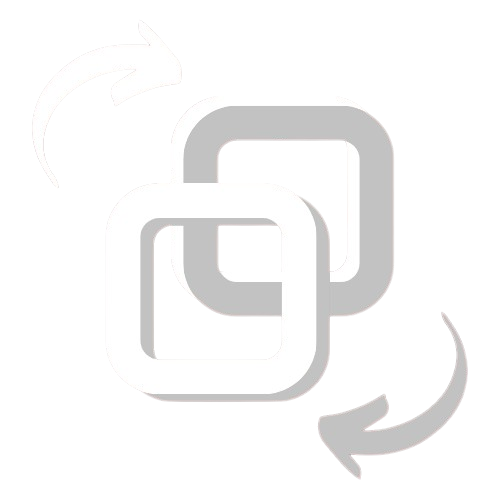
   Conver: Transforme Seus Documentos em Segundos!
  

      
      
      
  

</h1>

**Conver** é uma aplicação moderna e prática para conversão de arquivos. Com suporte a diversos formatos, o Conver foi projetado para transformar documentos rapidamente, proporcionando uma experiência de uso intuitiva e responsiva para o usuário. 

## 🖼️ Visualização do Projeto

### Versão Desktop

  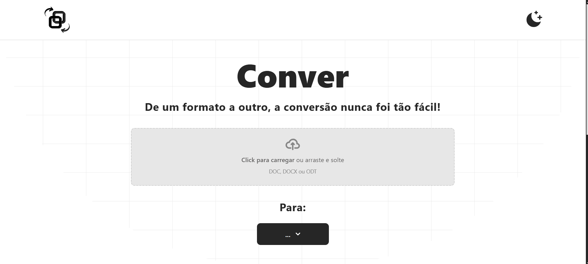 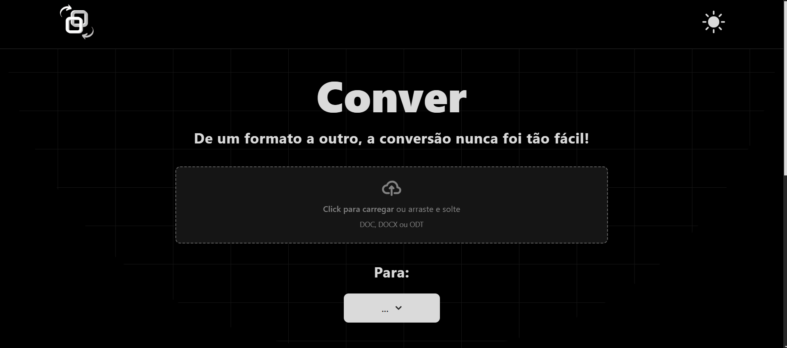
  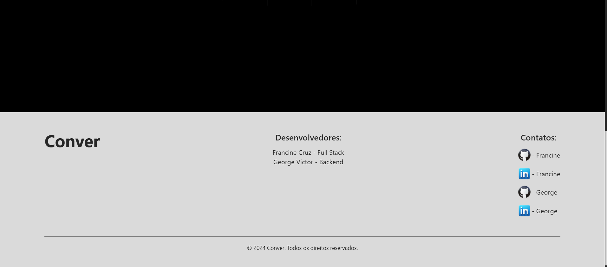 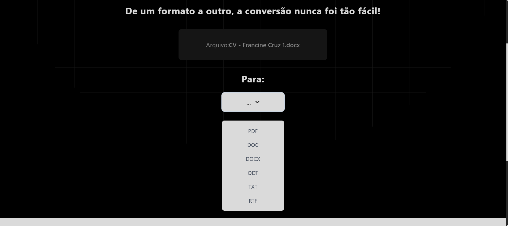
  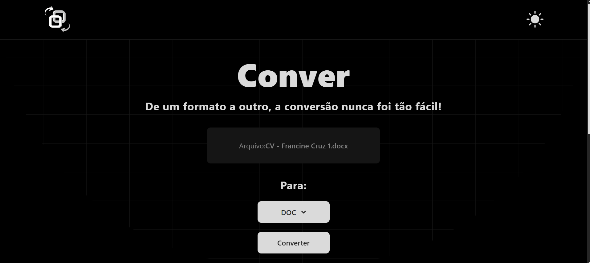 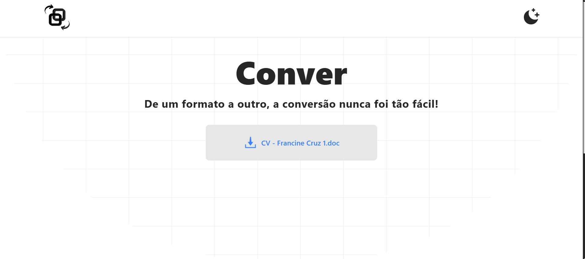

### Versão Mobile

  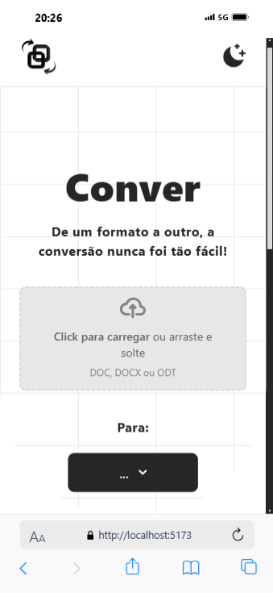 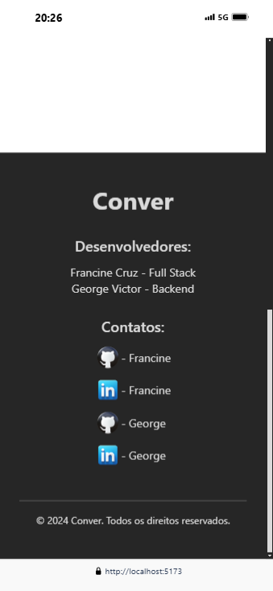
  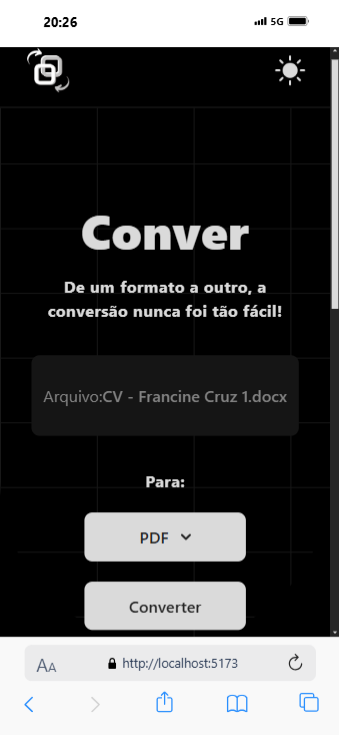 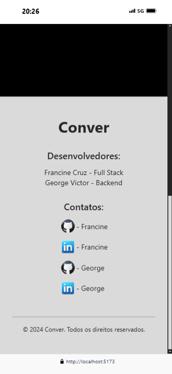

## 🎥 Demonstração em Vídeo

Para visualizar o funcionamento do Conver, faça o download do vídeo de demonstração:

[Download do Vídeo](./public/video.mp4)

## 🚀 Tecnologias Utilizadas

-  Biblioteca principal para construção da interface do usuário.
-  Framework de CSS para estilização responsiva e otimizada.
-  Ferramenta para desenvolvimento frontend rápido e eficiente.
-  Para segurança e consistência no código com tipagem estática.

## 🔄 Funcionalidades Principais

- **Conversão de Arquivos**: Suporte para conversão para formatos amplamente utilizados como DOC, DOCX, ODT, PDF, TXT e RTF.
- **Upload Simplificado**: Arraste e solte arquivos ou selecione-os manualmente.
- **Interface Responsiva**: Design adaptado tanto para desktop quanto para dispositivos móveis.
- **Modo Light/Dark**: Opção para alternar entre temas claro e escuro.
- **Feedback de Carregamento**: Exibição de status de carregamento para feedback visual ao realizar a conversão.

## 🔙 Backend
O backend do projeto foi desenvolvido por [George Victor](https://github.com/id0ubl3g) e é responsável por processar a conversão de arquivos. Ele recebe o arquivo carregado e o formato para converter, realizando a conversão e retornando para download. Confira [aqui](https://github.com/id0ubl3g/conver-flask-api) a documentação da API.

### 📄 Detalhes do Backend

A API Conver Flask é uma aplicação web desenvolvida com Flask, projetada para facilitar a conversão de documentos em vários formatos. Ela oferece uma solução prática para usuários que precisam de conversão eficiente de arquivos.

## 🔍 QA - Testes Automatizados
Este projeto também inclui uma estrutura de Testes Automatizados, que foi realizado por [Michael Maia](https://github.com/qamichaelmaia) usando Cypress para garantir que diferentes formatos de arquivos sejam carregados e convertidos corretamente, proporcionando uma experiência de uso confiável e sem erros. Confira [aqui](https://github.com/qamichaelmaia/conver-test) o repositório.

## 🤝 Colaboração

Este projeto foi desenvolvido com o suporte de [George Victor](https://github.com/id0ubl3g/conver-flask-api) para o backend, que gerencia o processamento e conversão dos arquivos. A divisão de responsabilidades foi:

- **Frontend**: Responsável pela criação da interface e experiência do usuário.
- **Backend**: API para o processamento dos arquivos e a lógica de conversão.

### Agradecimentos especiais pela contribuição para este projeto:
- [Michael Maia](https://github.com/qamichaelmaia) - Por realizar testes automatizados com Cypress para assegurar a confiabilidade do processo de conversão.

**Conver** é mais do que um simples conversor: é uma experiência que alia velocidade e praticidade para o usuário final. Aproveite para transformar seus documentos com facilidade!

## 🌐 Redes Sociais

Conecte-se conosco nas redes sociais:

- **LinkedIn**: [Francine Cruz](https://www.linkedin.com/in/francine-ccruz/)
  
- **LinkedIn**: [George Victor](https://www.linkedin.com/in/id0ubl3g/)
- **GitHub**: [George Victor](https://github.com/id0ubl3g)

## 📝 Licença

Este projeto está licenciado sob a **Apache 2.0**. Consulte o arquivo [LICENSE](LICENSE) para mais detalhes.
